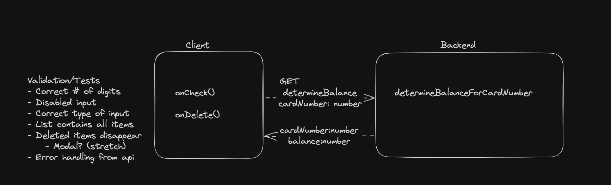

# Balance Checker

Simple balance checker that accepts 16 digits and returns a balance.
[Figma Mockup/Reqs](https://www.figma.com/file/47Ou1LPfOYkP7gRrRG3ECZ/Developer-Exercise----Bethel-Hailu?node-id=2%3A11&mode=dev)

## Demo

https://github.com/BethelH/dwbalance/assets/9140935/c8d602df-f754-4642-960f-f50c803ec6a6

### Libraries/Frameworks used

##### Backend
- Backend Framework [ExpressJs](https://github.com/facebook/create-react-app), Bootstrapped using [Express Generator](https://expressjs.com/en/starter/generator.html)
    - First time using express, was curious about how its structure would let me get a basic route done and testable and found it was quite nice. A bit heavy on the boilerplate and built-in comments but had a quick turnaround to hitting an api locally.

##### Frontend
- Spun up quickly with the [create react App](https://github.com/facebook/create-react-app) package.
    - Its is one of the quickest ways to get a single page react app off the ground for a small project
- [MaterialUI](https://mui.com/material-ui) for a styling/component library
    - Some prior experience with this component library, styling is a bit complicated since there are a handful of ways to go about it but pretty quick to get standard uis ready

### Planning

- This is kind of my 'product' ish way of diagramming the basic needs of the frontend and backend along with some immediate ideas to keep in mind during development and ticket breakdown

##### Frontend 'ticket' breakdown
- Create component to show the balance checker component and button
    - Create component to hold list of balances
    - Create component for balance row + formatting
    - Sort the cards in order of balance 
    - Validate on correct format
- Test for each component + its validation

##### Backend 'ticket' breakdown
- Research frameworks for quick spin-up
-  Make an api that accepts a 16 digit number
    - Make a provider that takes in the input
        - Last digit ends in 5 or 2, sum up first 12 numbers
        - else return 0
    - Test

### Good additions I didn't have time to do but would be nice
- Using Yup for validation
- Converting to Typescript (mostly because I'm more comfortable with the string typing but it also makes it nicer to test when you can export interfaces)
- Creating a flexible theme setup for the Mui components and a master theme
- Disabling the button on invalid number (not done in favor of design)
- Setting up github actions for auto running tests
- Creating a more fleshed out api structure to accommodate future moves to a db
- Modal to ask them to enter the full card number in order to delete it (+ are you sure check)
- Integration test
- Testing/Screenshots on a set of expected devices for use

